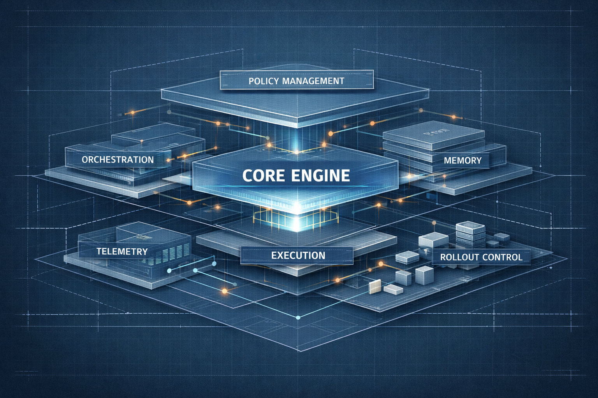

# Часть VII. Эталонная реализация

До этого момента мы собирали ту же систему по слоям:

- архитектура и trust boundaries;
- память;
- execution layer;
- observability;
- operating model.

Теперь пора собрать это в более цельную эталонную реализацию. Не как “идеальный фреймворк на все случаи жизни”, а как рабочую схему того же support-агента и окружающей платформы, которую можно взять за основу и развивать дальше.

!!! info "Короткий маршрут по этой части"
    Если тебе нужен быстрый проход, иди так:

    - [Глава 16](chapter-16.md): понять, как тот же support-агент собирается в единый runtime, а не в набор локальных хендлеров;
    - [Глава 17](chapter-17.md): посмотреть, как runtime получает явный слой политик и каталог возможностей;
    - [Глава 18](chapter-18.md): проверить, готов ли этот каркас к ограниченной выкладке и дальнейшему росту.

    Вместе это показывает, что эталонная реализация нужна не для демонстрации, а для закрепления всей production-системы в коде.

В этой части я буду постепенно собирать минимально взрослую платформу:

- базовый runtime;
- security и policy hooks;
- каталог возможностей;
- telemetry wiring;
- чеклист выкладки.

## Что решает эта часть

- собирает архитектуру, память, execution и observability в один runtime skeleton;
- закрепляет contract core через policy layer и capability catalog;
- делает approval и governed capability access явным поведением runtime, а не побочным ручным процессом;
- доводит этот каркас до first rollout readiness;
- превращает operating model из Part VI в исполнимую форму рантайма и rollout shape.

Именно здесь книга превращает абстрактные слои в runnable system. Это мост между ранним архитектурным аргументом и более поздним lifecycle argument.

## В этой части

- [Глава 16. Базовая схема рантайма](chapter-16.md)
  Эта глава продолжает тот же support-кейс на уровне кода: где должен жить run loop, как отделить policy, memory и execution, и как не распылить логику по локальным хендлерам.
- [Глава 17. Слой политик и каталог возможностей](chapter-17.md)
  Эта глава поднимает тот же каркас на контрактный уровень: какие capability вообще разрешены, где нужен approval, как должны работать pause/resume paths для подтверждения и как не зашивать риск-логику прямо в orchestration.
- [Глава 18. Чеклист промышленного запуска](chapter-18.md)
  Эта глава завершает ту же историю первым ограниченным rollout: готов ли support-агент к реальной выкладке, наблюдаемы ли approval/policy signals и что должно быть видно еще до масштабирования.

## Куда она ведет дальше

После этой части становится видно, как архитектура, безопасность, память, выполнение, наблюдаемость и approval control складываются в один operational skeleton. Но на этом production discipline не заканчивается.

Как только тот же агент переживает первый rollout, следующие вопросы уже естественно расходятся по новым ролям:

- change management решает, какие changes считаются release-bearing;
- assurance решает, как отвечать на drift и findings;
- provenance и approved artifacts сохраняют evidence backbone того, что реально было выкатано;
- observability вырастает из runtime wiring в evidence substrate на масштабе estate;
- registry и governance решают, кто за что отвечает по всему estate;
- retirement закрывает lifecycle, когда систему больше нельзя держать активной.

Именно поэтому следующий естественный шаг после reference implementation - [Часть VIII. Жизненный цикл агентной системы](../part-viii/index.md).
